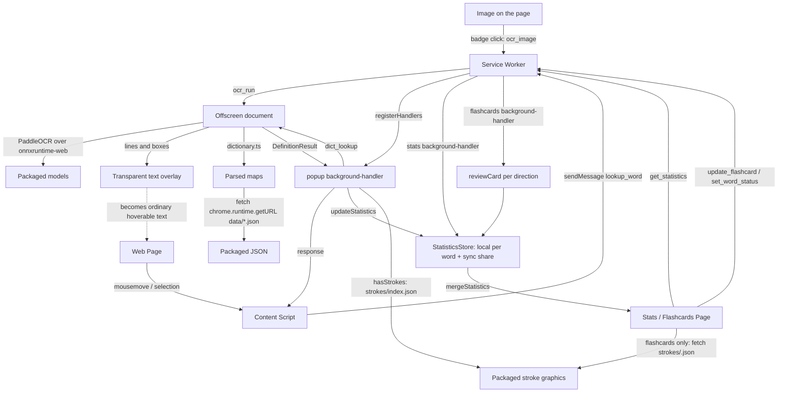

# Architecture Overview

Read the section for the area you are changing; each component section says
why it works the way it does, which is what a change is most likely to break.

| Working on | Read |
| --- | --- |
| Hover popup, Shift/Escape, Study/Known | Components → Content Script |
| Unknown-word marks, coverage chip | Components → Unknown Words on the Page |
| A message type or handler | Components → Background Handlers; Data Flow |
| Lookup, segmentation, enrichment | Components → Dictionary |
| Image or video OCR | Components → Media OCR; OCR Model |
| Stats list, insights, backup, export | Components → Statistics Page |
| Card directions, sessions, grading | Components → Flashcards Page |
| A new setting | Components → Settings |
| Anything written to `chrome.storage` | Storage |
| A permission or the manifest | Extension Permissions |
| Finding where a function lives | Key Classes and Utilities |

## Project Structure

The source is organised by feature domain, not by file type.

```
canto-toolbox/
├── manifest.json              # Chrome extension manifest (Manifest V3)
├── vite.config.ts             # Vite build configuration
├── vitest.config.ts           # Unit-test (vitest) configuration
├── playwright.config.ts       # E2E (Playwright) configuration
├── eslint.config.js           # Flat ESLint config (typescript-eslint)
├── tsconfig.json              # TypeScript configuration
├── flake.nix                  # Nix dev shell (Node 24 + pnpm)
├── .envrc                     # `use flake` — direnv loads the dev shell
├── .husky/                    # pre-commit (lint/typecheck/test), commit-msg
├── src/
│   ├── service-worker.ts      # MV3 service-worker entry; registers handlers
│   ├── popup/                 # Hover-popup feature (content script)
│   │   ├── content.ts         # Injected content script; hover/selection detection
│   │   ├── background-handler.ts # lookup_word / track_word / mark_known / segment_text
│   │   ├── popup-client.ts    # Typed client wrapper over sendMessage
│   │   ├── page-coverage.ts   # Unknown-word marks and the page coverage chip
│   │   ├── known-words.ts     # Page words joined with the record; known-set cache
│   │   ├── popup-storage.ts   # Statistics write path (debounced, bounded)
│   │   └── popup.scss
│   ├── stats/                 # Statistics page
│   │   ├── stats.ts / stats.html / stats.scss
│   │   ├── stats-view.ts      # DOM rendering; element ids live here
│   │   ├── background-handler.ts # get_statistics / get_review_log handler
│   │   ├── stats-client.ts
│   │   ├── overview.ts        # Due/accuracy summary over the whole record
│   │   ├── insights.ts        # Forecast, streak, retention, band coverage
│   │   ├── ordering.ts        # List sorting and frequency-band filtering
│   │   ├── backup.ts          # Backup file format, validation, merging restore
│   │   ├── card-export.ts     # Anki / Pleco text export of the deck
│   │   ├── transfer-controls.ts # Backup, restore and export buttons
│   │   └── stats-storage.ts   # Statistics read path (sync+local merge)
│   ├── flashcards/            # Flashcard review page
│   │   ├── flashcards.ts / flashcards.html / flashcards.scss
│   │   ├── flashcards-view.ts # Screens, card faces, element ids
│   │   ├── session.ts         # Card selection across the review directions
│   │   ├── writing.ts         # Stroke-order quiz and the grade it measures
│   │   ├── listening.ts       # Which reading the listening card plays in
│   │   ├── background-handler.ts # update_flashcard / set_word_status
│   │   └── flashcard-client.ts
│   ├── settings/              # Options page (manifest `options_ui`)
│   │   ├── settings.ts / settings.html / settings.scss
│   │   └── settings-view.ts   # Form built from the setting specs; its copy
│   ├── ocr/                   # Reading Chinese out of images and video frames
│   │   ├── media-controller.ts # Media hover, the badge, overlay lifecycle
│   │   ├── capture.ts         # Video frame → pixels, canvas or tab screenshot
│   │   ├── overlay.ts         # Recognised box → positioned transparent text
│   │   ├── engine.ts          # PaddleOCR over onnxruntime-web, models on disk
│   │   ├── offscreen.ts       # Engine cache and queue; loaded lazily
│   │   ├── background-handler.ts # ocr_image / capture_tab; forwards to the host
│   │   ├── ocr-client.ts
│   │   └── ocr.scss
│   ├── dictionary/
│   │   ├── dictionary.ts      # Runtime dictionary load + lookup
│   │   └── offscreen-handler.ts # dict_lookup; the maps live in this document
│   ├── offscreen/             # Offscreen composition root (dicts + OCR)
│   │   ├── offscreen.html
│   │   └── offscreen.ts       # register() of dictionary and OCR handlers
│   ├── shared/                # Cross-feature utilities and UI components
│   │   ├── message-manager.ts # sendMessage() typed message helper
│   │   ├── message-router.ts  # registerHandlers() onMessage routing
│   │   ├── offscreen-document.ts # ensureOffscreenDocument(); one host
│   │   ├── statistics-store.ts# Per-word layout, cap, sync share, migration
│   │   ├── review-log.ts      # Cards answered per local day (local only)
│   │   ├── statistics-utils.ts# mergeStatistics(), getFlashcardStage()
│   │   ├── settings.ts        # Reader preferences: specs, defaults, watchSettings()
│   │   ├── scheduler.ts       # FSRS review scheduling
│   │   ├── bounded-map.ts     # Top-N-by-sort-key map
│   │   ├── debounce.ts        # createBatchedDebounce()
│   │   ├── dom-element.ts     # createElement()
│   │   ├── strokes.ts         # Packaged stroke graphics, one file per character
│   │   ├── frequency.ts       # Corpus rank → learner-facing band
│   │   ├── frequency-badge.ts # The band/rank chip on a definition
│   │   ├── availability-badge.ts # "Mandarin only" / "Cantonese only" chip
│   │   ├── decomposition.ts   # Component glyphs of an IDS decomposition
│   │   ├── definition-list.ts # Collapsing sense list
│   │   ├── pronunciation-section.ts # Pronunciation section component
│   │   ├── speech.ts          # Browser TTS, per-reading voice matching
│   │   ├── etymology-section.ts     # Etymology section component
│   │   ├── definition-section.ts    # Shared definition-container component
│   │   ├── context-sentence.ts      # Met-in sentences, plain or cloze-blanked
│   │   ├── word-contexts.ts   # Which sentences a word keeps, and what of their page
│   │   ├── gloss.ts           # Short English gloss for a production prompt
│   │   ├── pinyin.ts          # toSyllables() tone-tagged syllable split
│   │   ├── styles/            # Shared SCSS partials (tokens, dark mode, …)
│   │   └── types.ts           # TypeScript type definitions
│   └── vite-env.d.ts
├── public/
│   ├── data/                  # radicals.json (checked in);
│   │                          # mandarin/cantonese/etymology/frequency.json
│   │                          # (generated)
│   ├── strokes/               # One file per character + index.json (generated)
│   └── ocr/                   # PP-OCRv6 tiny + the ONNX runtime (generated)
├── build-tools/               # Build-time dictionary processing
│   ├── build-dictionaries.ts  # Dictionary build entry
│   ├── build-strokes.ts       # Splits graphics.txt into per-character files
│   ├── fetch-ocr-assets.ts    # Vendors the OCR models and ONNX runtime
│   ├── benchmark.ts / generate-screenshots.ts
│   ├── prepare-worktree.sh    # Readies a git worktree from the main checkout
│   └── processors/            # cedict-parser, mandarin/cantonese/etymology,
│                              # frequency, utils (+ __tests__/)
├── dictionaries/              # Source data (submodules)
│   ├── mandarin/              # CC-CEDICT
│   ├── cantonese/             # CC-Canto
│   └── makemeahanzi/          # Character etymology
├── e2e/                       # Playwright specs
├── icons/
└── .claude/
    ├── agents/                # dict-inspector, doc-reviewer, domain-reviewer
    └── docs/                  # Project documentation (this file lives here)
        ├── architecture.md
        ├── dev-workflow.md
        ├── git-conventions.md
        └── testing.md
```

## Architecture Flow


```mermaid
flowchart TD
    I[Image on the page] -->|badge click: ocr_image| C
    C -->|ocr_run| O[Offscreen document]
    O -->|PaddleOCR over onnxruntime-web| P[Packaged models]
    O -->|lines and boxes| N[Transparent text overlay]
    N -.->|becomes ordinary hoverable text| A
    A[Web Page] -->|mousemove / selection| B[Content Script]
    B -->|sendMessage lookup_word| C[Service Worker]
    C -->|registerHandlers| H1[popup background-handler]
    H1 -->|dict_lookup| O
    O -->|dictionary.ts| D[Parsed maps]
    D -->|fetch chrome.runtime.getURL data/*.json| E[Packaged JSON]
    O -->|DefinitionResult| H1
    H1 -->|response| B
    H1 -->|updateStatistics| F[StatisticsStore: local per word + sync share]
    G[Stats / Flashcards Page] -->|get_statistics| C
    G -->|flashcards only: fetch strokes/<char>.json| S[Packaged stroke graphics]
    H1 -->|hasStrokes: strokes/index.json| S
    C -->|stats background-handler| F
    F -->|mergeStatistics| G
    G -->|update_flashcard / set_word_status| C
    C -->|flashcards background-handler| H2[reviewCard per direction]
    H2 --> F
```

## Components

### Content Script (`src/popup/content.ts`)

- **Purpose**: Detect Chinese text under the cursor / in a selection and show a popup.
- **Key class**: `ChineseHoverPopupManager` — popup display and selection logic.
- **Responsibilities**: inject styles; listen for `mousemove`/`mouseout`/`mouseup`
  (throttled on the animation frame alone, cancelled on `destroy()`); skip
  hit-testing replaced elements that cannot hold a caret; ignore lookup
  replies for a word the cursor has already left; detect Chinese with
  `[一-鿿]+`; take the whole run at the caret
  (`document.caretRangeFromPoint`, with a realm-safe `nodeType` check so
  frames work) and send it with the hovered offset, leaving segmentation to
  the dictionary; request a lookup via `popup-client` (`sendMessage`); render
  the popup with the shared section components.
- **Asking, not passing**: a word is looked up only once the cursor has rested
  on it for `HOVER_INTENT_MS`. Hovering is how a reader crosses a page as well
  as how they ask about a word, and without the pause every word passed over
  opened a popup. Leaving the word then starts a short grace period rather than
  hiding at once — the popup is offset from the cursor, so reaching its audio or
  **+ Study** button means crossing text that is not the word. Hovering the
  popup cancels both the pending hide *and* any pending lookup, so words crossed
  on the way to it neither dismiss the popup nor replace the word it shows.
  The popup is positioned against the viewport, so its place on the *page* is
  kept and a document scroll moves it by hand — otherwise it would hang over
  whatever scrolled into the word's place.
- **Shift skips the pause**: a move made with Shift held, or Shift pressed
  while a lookup is pending, runs it at once. Shift is a deliberate ask, so the
  pause has nothing left to decide. It is ignored while a mouse button is down
  (Shift-click and Shift-drag extend a selection) and while a text field or
  `contenteditable` has focus, where Shift is typing.
- **Escape closes it**, cancelling any pending lookup and the dwell with it —
  a word dismissed was not studied. The key is not consumed, since the page
  may use Escape too.
- **Study signal**: showing a popup is not studying. After `DWELL_MS` with the
  popup still on the same word, the script sends `track_word` — once per word,
  along with `extractContext`'s snippet of the sentence it was met in and the
  page's `location.href` and `document.title` (added by `popup-client.ts`, and
  sent whole — the write path decides what of them is kept). The popup's
  **+ Study** button sends the same message at once, with `pin` set.
- **Known**: beside **+ Study**, a toggle that sends `mark_known` — the same
  retirement `set_word_status` makes (`suppressed`, progress kept, the pin
  cleared), but it records a word not yet tracked so the retirement has an
  entry to stick to, and it is not a sighting: the count is untouched and the
  pending dwell is cancelled. The lookup is sent with `withStatus`, so the reply
  carries the word's `status` and the button shows as pressed on a word
  already retired; pressing it again puts the word back. The two buttons
  redraw each other, since each decision clears the other.
- **What un-retires a word**: only a decision — Known pressed again, **+
  Study**, or the stats and flashcard pages' own controls. A dwell is a
  sighting, so it never undoes a Known pressed a moment earlier.
- **Following a component**: a chip in the character breakdown whose glyph the
  dictionaries hold an entry for is a button, and pressing it puts that entry
  in the popup with a back control to the word it came from. The trail is the
  popup's alone — a fresh hover starts a new one — and the definitions on it
  are the ones already fetched, so stepping back costs no lookup. Only the
  popup passes `onFollowComponent`; the stats and flashcard surfaces render the
  same breakdown with its chips as labels.
- **Following a character**: the headword itself splits the same way. Each
  character of a compound the dictionaries hold an entry for
  (`charactersWithEntries`, added by the lookup) is a button in the popup's
  heading and joins the same trail — a compound is read through its parts as
  much as a character is read through its components. A single-character word
  stays a plain heading, since it leads nowhere.

### Unknown Words on the Page (`src/popup/page-coverage.ts`)

- **Purpose**: show which words on a page the reader does not know yet, and
  what share of the page's words they do, so a learner can pick text at their
  level. Opt-in (`markUnknownWords`, off by default); `content.ts` hands it the
  settings alongside the popup, so switching it applies to open tabs at once.
- **No DOM changes**: unknown words are a CSS Custom Highlight
  (`CSS.highlights`, name `canto-unknown`) over `Range`s, drawn as a dotted
  underline in the OCR hairline's colours. No text node is wrapped or split, so
  the page's scripts and the popup's `caretRangeFromPoint` see the page exactly
  as before, and a decoration takes no layout space. Without the API (not in
  Chrome before 105) the figure is still counted.
- **What is read**: text nodes holding Chinese under `body`, walked by hand so
  skipped subtrees are pruned — scripts, form fields, `contenteditable`, text
  `checkVisibility` says is hidden, and the extension's own UI: the popup, the
  chip and the OCR overlay (text guessed out of a picture is not the page's).
  The content script is not `all_frames`, so only the top frame is read;
  iframes are neither marked nor counted. A run split across elements
  (`<b>中</b>文`) is segmented per text node, as a hover takes it.
- **Scheduling**: nodes nearest the viewport go first, in slices of
  `SLICE_CHARS` sent one at a time behind `requestIdleCallback`, up to
  `MAX_PAGE_CHARS` per page. The offscreen document is single-threaded and
  hovers queue behind whatever it is doing, so a lookup waits for one slice at
  most. Each node's result is kept with the text it was read from, so a later
  pass sends only nodes that are new or changed and drops ranges for ones gone.
- **Re-reading**: a `MutationObserver` on the body (ignoring the extension's
  own UI) schedules a pass `RESCAN_DELAY_MS` after the first change — not
  pushed back by later ones, or a ticking clock would starve it. A URL change
  (seen on the next pass, or by `popstate` / `hashchange`) starts the page's
  figure afresh. A statistics change re-asks every word, but only when
  `changesKnown` says a verdict moved: a dwell's count going up changes none,
  so reading does not trigger re-reads. Old marks stay until replaced.
- **The join happens in the worker**: `segment_text` carries the runs; the
  worker forwards `dict_segment` to the offscreen document and judges each
  word against the record through `KnownWordsCache` (`known-words.ts`), which
  reads the record once and drops it only when `changesKnown` fires. A tab thus
  receives a verdict per word, never the record, and the worker already reads
  the record for the popup's Known state.
- **Known** is `isKnown` (`statistics-utils.ts`) — the rule the stats page's
  band coverage uses — checked against the word and its other script form,
  since a word is recorded in the script it was hovered in.
- **Coverage**: word tokens known over word tokens counted, each occurrence
  weighted, plus the number of distinct unknown words (`summariseCoverage`).
  Characters no entry covers are skipped; single-character words, function
  words included, count like any other. A proper noun — CC-CEDICT capitalises
  its pinyin — is left out of both marks and figure only when SUBTLEX-CH does
  not rank it: 中國 and 中文 are capitalised too and are vocabulary. Rare words
  count; a text full of them is a hard text. The figure is withheld below
  `MIN_WORDS_FOR_FIGURE` words.
- **The chip** sits fixed in the bottom-right corner ("82% known · 14 new
  words"); its × hides it until the URL changes, leaving the marks. It is not
  repeated on the action popup: the figure describes the page in front of the
  reader, where the chip already is, and reaching the tab from the popup would
  add a tab message for no new information.

### Service Worker (`src/service-worker.ts`)

- **Purpose**: MV3 background entry point. It does not contain handler logic
  itself — it imports each feature's `background-handler.ts` and calls their
  `register()` to attach `chrome.runtime.onMessage` listeners.

### Background Handlers (`*/background-handler.ts`)

- Each handler registers through `registerHandlers()`
  (`src/shared/message-router.ts`), which owns the parts every listener would
  otherwise repeat: the async response channel (`return true`), passing an
  unrecognised message through (`return false`) so another feature's listener
  can answer it, and turning a thrown error into an `ErrorResponse`.
- **popup**: handles `lookup_word`, `track_word` and `mark_known` (the paths
  that write new statistics). Lookups are forwarded as `dict_lookup` to the
  offscreen document that holds the parsed maps. A lookup sent `withStatus` —
  only the popup's — also reads the record, in parallel with the dictionary
  hop, and replies with the matched word's `status`; the stats and flashcard
  pages already hold the record, so theirs skip the read. A failed read costs
  the reply its status, not its definition. A tracked word also records what the
  dictionary knows about it — its corpus rank, whether it is a single character
  with named parts, and whether the stroke data covers it — since the pages
  that build sessions cannot look any of them up. Stroke coverage and
  decomposability are asked separately: a character can have strokes without
  its etymology naming any parts. `segment_text` splits page text into words
  through `dict_segment` and returns whether the reader knows each one (see
  Unknown Words on the Page).
- **stats**: handles `get_statistics` (reads merged sync+local statistics)
  and `get_review_log` (reads the per-day review log).
- **flashcards**: handles `update_flashcard` (advances one direction's FSRS
  state, buries a word once its lapses reach `LEECH_LAPSES`, and adds one to
  today's count in the review log) and
  `set_word_status` (retire or pin a word, keeping its progress).
- Message passing is plain functions, not a class. The typed send helper is
  `sendMessage()` in `src/shared/message-manager.ts`; each feature has a thin
  `*-client.ts` wrapper around it.

### Dictionary (`src/dictionary/dictionary.ts`)

- **Purpose**: Load and search the dictionaries.
- **Where it runs**: the offscreen document (`src/offscreen/`), via
  `offscreen-handler.ts`. The service worker is torn down on idle, which would
  discard the parsed maps between one hover and the next; Chrome allows only
  one offscreen document, so dictionaries share the host already used for OCR.
  The worker's `lookup_word` handler starts that document (if needed) and
  forwards. The OCR engine is imported only when an image is read, so a hover
  does not pay for the model.
- **Loading**: `initDictionaries()` lazily `fetch`es
  `chrome.runtime.getURL('data/{mandarin,cantonese,etymology,frequency}.json')`
  (the JSON is a packaged `web_accessible_resource`, **not** statically
  imported/bundled) and parses it **once**. Mandarin and Cantonese arrive as a
  compact `rows`+`index` form so each unique entry is stored once; both script
  forms share a row. Etymology and frequency stay keyed maps.
- **Lookup**: after the one-time async load, `lookupWord` is synchronous —
  longest-match over up to `MAX_WORD_LENGTH`, Cantonese-marker filtering, and
  `lookupEtymology` for character breakdown.
- **Enrichment**: the longest-match scan tries a candidate per length and start
  offset and throws away all but one, so the parts not needed to judge a
  candidate — the character breakdown and the corpus rank — are added by
  `enrich` to the winner alone. `lookupEtymology` memoises into a capped cache,
  since the same characters recur as the cursor moves. The breakdown also
  carries `componentsWithEntries` — the parts that are words in their own right —
  because only the document holding the maps can say which components are
  worth following. `charactersWithEntries` says the same of a compound's own
  characters, for the same reason.
- **Segmentation**: `segmentRun` walks a run left to right taking the longest
  word from each point — `lookupWord`'s scan, repeated — and steps over a
  character no entry starts with. It checks the index before decoding a row and
  enriches nothing, so it leaves the hover path untouched. Each word carries
  its other script forms and whether it is an unranked proper noun.
  `dict_segment` answers many runs per message.

### Media OCR (`src/ocr/`)

- **Purpose**: make Chinese baked into a picture — an image, or the frame a
  video is paused on — readable by everything that already reads Chinese on
  the page. It is a text *source*, not a second lookup path: `overlay.ts` turns
  recognised boxes into transparent, positioned text nodes, and from there the
  content script's own `caretRangeFromPoint` handling finds them exactly as it
  finds text the page wrote itself. `ChineseHoverPopupManager`, `dictionary/`,
  `stats/` and `flashcards/` do not know pictures exist; the one wire between
  the two is `content.ts` starting `mediaOcrManager` alongside `popupManager`,
  since both run in the content script and one entry point has to bootstrap
  the other.
- **Trigger**: `media-controller.ts` shows a badge on hovering an image or
  video at least `MIN_MEDIA_SIDE_PX` on both sides; clicking it reads it. The
  model loads on the first click, never on page load. A video is only offered
  **while paused** — a frame the reader is still watching is one they have
  already left, and the badge would fight the player's own controls for the
  same corner. What is on offer is reconsidered on `play` and `pause` as well
  as on hover, since every way a reader pauses (space, `k`, a click on the
  picture) leaves the cursor where it was and fires no pointer event.
- **Following playback**: once a frame is read, `play` clears the overlay (text
  read off one frame is wrong for every frame after it) while `pause` and
  `seeked` read the new frame, so stepping between subtitles needs no further
  clicks. A pause on the frame already read is ignored.
- **Capturing a frame** (`capture.ts`): drawing the element is tried first —
  free, no permission, and it yields the video's own resolution. On a 1080p
  stream in an 822px-wide player that is over twice the linear resolution a
  screenshot of the tab would give, which is most of the difference between
  reading subtitles and guessing at them. Media-Source video (what every
  streaming player uses, YouTube included) is fed by the page itself and so is
  *not* tainted, which is why this works where re-fetching a URL cannot. Only a
  `SecurityError` falls back to `chrome.tabs.captureVisibleTab`, which sees
  composited pixels and is blind to nothing but DRM; the crop back to the
  video's rect derives its scale from the screenshot rather than trusting
  `devicePixelRatio`, which lies on a zoomed page.
- Note that **captions a site renders as DOM text need none of this** — the
  popup already reads them. YouTube's own captions are `<span>` text nodes, so
  OCR is only for subtitles burned into the picture.
- **Where it runs**: the shared offscreen document (`src/offscreen/offscreen.html`).
  The service worker has no DOM and is torn down on idle, which would discard
  the loaded weights between one image and the next; `ensureOffscreenDocument()`
  (`src/shared/offscreen-document.ts`) starts the document and the worker
  forwards. `src/ocr/offscreen.ts` serialises requests behind one queue — a
  single inference session cannot usefully be contended for — and caches
  results by image URL in a `BoundedMap`. A `data:` source is never cached: the
  key would be the whole picture, megabytes of string per entry, and a hit
  would need byte-identical pixels twice, which a video frame never produces.
  The engine module is dynamically
  imported on the first `ocr_run`, so hosting dictionaries in the same
  document does not load the model on hover.
- **Engine**: `engine.ts` runs PP-OCRv6 tiny through `ppu-paddle-ocr/web` over
  `onnxruntime-web`. Models and the runtime are fetched from
  `chrome.runtime.getURL('ocr/…')`, so no network access is involved. It must
  *overwrite* `ort.env.wasm.wasmPaths` rather than fill it in, since the
  library points it at a CDN from its own module body.
- **Placement**: `overlay.ts` puts the *i*th character in the *i*th slot of its
  box rather than reproducing the image's typography — that is what the caret
  needs. For Chinese it is exact, since every glyph is full width. Overlays
  live in the body and are positioned in page coordinates, so an ancestor's
  `overflow` or stacking context cannot clip them, and they are re-laid from
  the held result when a responsive page redraws the image at a new size.
- The badge carries no text. A label legible enough to mean "read this" would
  have to be Chinese, and Chinese on the page is something the popup looks up.

### Statistics Page (`src/stats/`)

- **Key class**: `StatsManager` (`stats.ts`) — data loading and event wiring.
  All DOM construction lives in `stats-view.ts`, which also owns the element
  ids the page's HTML and its tests share.
- Renders the frequency list with lazily-expanded definitions (rendered by the
  shared `definition-section`), every sentence each word was met in — each
  linking to its page in a new tab (`rel="noopener"`) where one was kept —
  study counts, and a clear action.
- Above the list, `overview.ts` summarises the whole record — cards due now,
  due today, review accuracy and retired count — deliberately unaffected by the
  list's own filters. `ordering.ts` supplies the frequency-band filter and the
  sort (most studied, most common, due soonest, recently seen).
- Below the overview, four collapsible **insights** (`insights.ts` for the
  logic, `stats-view.ts` for the DOM), closed by default with a headline in
  each summary line so the popup stays compact. Like the overview they read
  the whole record and leave retired words' schedules out:
  - **Review forecast** — cards due on each of the next `FORECAST_DAYS` local
    days, overdue cards counted on today, as CSS bars.
  - **Activity** — the current streak and a calendar heatmap of the review
    log over `ACTIVITY_WEEKS`. The log starts empty for existing users, so an
    empty log is reported as such rather than drawn as months of rest days.
    A streak survives until the end of a day not yet studied.
  - **Retention by card** — accuracy per review direction, walked over
    `DIRECTION_FIELD` so a new direction appears without edits here.
  - **Known by frequency** — known words per band against `BAND_SIZES`.
    *Known* means the recognition card is familiar or mastered, or the reader
    retired the word; a word buried as a leech is retired but not known.
    The rule is `isKnown` in `statistics-utils.ts`, shared with the page's
    unknown-word marks so a word counts the same way on both.
- Each row can retire a word or pin it for study, through `set_word_status`.
- **Retired words are left out of the list** unless the **Show retired** pill is
  pressed — the one filter that is on by default, since a retired word was taken
  out of the deck deliberately. The stage and band counts follow it, so a pill
  never promises rows the list will not show; the retired pill's own count
  always reports the whole retired set, because it says what pressing it would
  reveal. With the pill pressed, each retired row carries its own **Retired**
  badge beside the stage badge — retirement is not a stage, and the only other
  sign of it was a button inside the row's own panel.
- The **Candidates** stage pill is where words enter the deck by hand: it holds
  every word seen too rarely to have enrolled itself, ranked by the default
  "most studied" sort, so the ones nearest the threshold are the ones offered
  first and each row's **Study this** is one click.
- **Backup and export** (`transfer-controls.ts`, folded under the filters):
  **Back up** downloads the whole record as versioned JSON (`backup.ts`);
  **Restore** validates such a file and merges it through `mutateStatistics`
  with the backup in the sync area's place — counts, dates and schedules
  resolve as they do between the two areas, including a word's retire and
  study decisions, where the later one wins. Nothing is replaced, so an
  old file cannot wipe newer progress. A file picker closes the action popup,
  so Restore in the popup opens the page in a tab (`#restore`) instead.
  **Anki** and **Pleco** export the deck (enrolled or scheduled, not retired)
  or every tracked word as text (`card-export.ts`). Readings and definitions
  are not in the record, so each word is looked up through `lookup_word`, a
  few at a time, with progress shown. A card has one sentence field, which
  takes the first sentence the word was met in.
- Backups validate `contexts` and still accept the single `context` string of
  older ones; a source that is not an http(s) address is refused, since the
  page renders it as a link. The format version is unchanged: an older restore
  carries fields it does not know, so it can still read a newer file.

### Flashcards Page (`src/flashcards/`)

- Spaced review driven by `src/shared/scheduler.ts` (FSRS). Each word carries a
  schedule per **review direction**: `recognition` (word → meaning, stored under
  the original `flashcard` key), `production` (meaning + cloze sentence → word),
  `listening` (the word spoken → meaning), `components` (character → its parts)
  and `writing` (character → its stroke order). Production and listening unlock
  once recognition leaves its learning steps; components additionally needs
  `decomposable` and writing needs `writable`, both recorded at track time
  because this page has no dictionary.
- The **listening card** depends on the browser rather than the word: it is
  offered only when a voice can say it, in Cantonese when a Cantonese voice
  exists and Mandarin otherwise (`listening.ts`), and the answer says which was
  played. The session waits for the voice list (`whenVoicesReady`), since
  Chrome reports it empty until it loads. Without a voice, `selectSession`
  neither introduces a listening card nor lets a due one take the word's slot,
  and `nextReviewAt` leaves it out — its schedule waits for a browser that can
  play it. The front autoplays and replays on its button or `R`; Chrome refuses
  speech before the tab's first click or key, so the first card of a freshly
  opened tab may need the replay.
- `flashcards.ts` runs the session; `flashcards-view.ts` renders the screens and
  card faces and owns the element ids.
- `selectSession` (`session.ts`) takes the cards the scheduler says are due,
  most overdue first, then tops the session up with cards not yet introduced —
  ordered by corpus rank, so the commonest word met is taught first — capped at
  the reader's new-card limit within their session size (`SessionLimits`,
  from settings). A word offers **at most one card per
  session**, and retired words are skipped. With nothing due, the empty screen
  reports when the next review lands.
- A word joins the deck only once `isEnrolled` says so — pressed **+ Study**, or
  met as many times as the reader's threshold (`MIN_COUNT` by default).
  Hovering still records every word; what it no longer
  does is spend a session slot on one. The threshold gates the *first* card a
  word is offered, so raising it never evicts a word already being reviewed.
- The **writing card grades itself** (`writing.ts`): hanzi-writer draws the
  character's outline and counts how many strokes went in the wrong place, and
  that count picks the grade — none is Good, one or two is Hard, three or more
  is Again. It is the one card with no rating buttons, so the quiz has to be
  able to end on its own: a stroke missed five times is marked correct and the
  quiz moves on, or the reader would have nothing to press past. "Easy" is never
  awarded, since the reader has no way to disagree with a measured grade. The
  outline is deliberately shown — this card tests the *order* of the strokes,
  and withholding the character would make it a recall card the deck has two of
  already.
- "Again" re-queues a card within the session, but the scheduler hears each card
  **once per session**: a requeued answer or a "Review Again" round is a drill,
  and rating it again would have FSRS recompute stability over an interval of
  roughly zero. "I know this" (or `K`) retires the word outright.
- Definitions render via the shared `definition-section`; only the production
  front needs a lookup before the question can be posed. The production and
  listening answers lead with the word, since their fronts withheld it.
- The page reads the settings before it builds a session, since they size it.
  A change made mid-session reaches the next card drawn but never resizes the
  session already chosen. `TESTS_READING` (`flashcards-view.ts`) names the
  directions whose answer *is* the reading; those backs ignore "hide
  romanisation", and a new direction has to say which it is.
- **Which sentence a card shows** (`contextForReview`): the word's sentences
  taken in turn by that card's review count, so the production cloze is cut
  from a different sentence each session rather than cueing the same one
  every time. Answers show the same sentence with a link to its page; the
  production front shows none, since a page title can name the word asked for.

### Settings (`src/settings/`, `src/shared/settings.ts`)

- **What they are**: the reader's preferences — session size, new cards per
  session, the enrolment threshold, which reading leads, which script the
  headword is drawn in, whether romanisation waits for a press, and whether
  unknown words are marked on the page. Every default reproduces what the
  extension did before it had settings.
- **One declaration each**: `SETTING_SPECS` states a setting's kind (integer,
  choice, boolean), default and range; the `Settings` type, `DEFAULT_SETTINGS`
  and `normaliseSettings` all follow from it. Sync storage is written by every
  machine the reader uses, so a stored value is clamped or replaced by its
  default rather than trusted. The options page builds its controls from the
  same specs and takes only its labels from `SECTIONS` in `settings-view.ts` —
  a new boolean is one spec line and one label entry.
- **Reaching consumers**: pure code never reads storage. The content script,
  stats page and flashcards page each call `watchSettings()` at start-up, which
  delivers the stored value and then every change (`chrome.storage.onChanged`),
  and hand the values on: `selectSession` takes `SessionLimits`,
  `isEnrolled` / `getFlashcardStage` take the threshold (the stats page carries
  it on its `ListView`, and hands it to the deck export), and the shared definition components take
  `DisplaySettings`. A change applies from the next popup, card or opened row;
  the stats list redraws at once, since the threshold moves words in and out of
  Candidates.
- **Display**: `primaryLanguage` orders the two columns; `script` picks the
  headword form through `headwordFor`, with `findScriptVariant` then naming the
  page's own form beside it (the stats row and flashcard fronts still show the
  word as it was tracked); `hideRomanisation` puts each reading behind a
  "Show Pinyin" / "Show Jyutping" button in the shared pronunciation section.
- **Entry point**: the gear in the stats page's header calls
  `chrome.runtime.openOptionsPage()`; the manifest registers the page as
  `options_ui` with `open_in_tab`.

## Data Flow

0. **Image text (optional)** — clicking an image's badge sends `ocr_image`;
   the offscreen document reads it and replies with lines and boxes, which the
   content script lays over the image as transparent text. Every step below
   then applies to it unchanged.
1. **Hover/selection** — content script extracts the Chinese word and calls
   `sendMessage({ type: 'lookup_word', word })`.
2. **Lookup** — popup `background-handler` forwards `dict_lookup` to the
   offscreen document, which awaits `initDictionaries()`, calls `lookupWord`
   (or `lookupWordAt` when a hovered segment is supplied), and replies with a
   `DefinitionResult`. The worker maps that back onto `lookup_word`, adding the
   word's retired/chosen `status` when the popup asked `withStatus`.
3. **Display** — content script renders the popup near the cursor.
4. **Statistics** — a `track_word` (sent after the reader dwells on a word, or
   at once when they press Study in the popup) increments its count through
   `StatisticsStore` (transform the reconciled record, write the words that
   changed) and
   adds the sentence it was met in (if the word holds none like it) with its
   page, its corpus rank, and whether it can
   carry a components or a writing card. A `mark_known` (the popup's Known)
   retires the word through the same batch without counting it. The
   stats/flashcards pages read both
   areas and reconcile with `mergeStatistics`, which preserves every field a
   word carries rather than the handful the merge names.
5. **Page coverage (optional)** — with `markUnknownWords` on, the content
   script sends the page's runs in slices as `segment_text`; the worker
   forwards `dict_segment`, joins the words with its cached known set, and
   replies with a verdict per word, which the page draws as a highlight and a
   coverage chip.

## Storage

- **Statistics**: one item per word, `word:<word>`, in `chrome.storage.local`,
  held by a `StatisticsStore` in `src/shared/statistics-store.ts`. The layout,
  the store and the `MAX_TRACKED_WORDS` cap live there so the write path, the
  stats page's warning and the flashcard handler all address the same record.
  Every writer goes through `mutateStatistics`, which transforms the whole
  reconciled record but writes back only the words whose serialised form
  changed and removes the ones the transform dropped — so a hover costs one
  item, not the record. The record used to be a single item that every write
  rewrote whole; one item per word was chosen over shards because a shard would
  still be rewritten for one word, and `chrome.storage` charges nothing per item
  that shards would save. Mutations in one context run one at a time, since each
  reads what the last wrote.
- **Local is the authority.** `unlimitedStorage` lifts its quota, so it is the
  area every write reaches.
- **Decisions are timed.** Retiring or choosing a word, or undoing either,
  stamps it with `statusAt` (`applyWordStatus`), and a merge takes the flags
  of whichever side decided last. Letting local decide regardless meant a
  retirement made on one device never reached another that held the word: that
  device kept its own flags and wrote them back to sync, undoing the decision
  everywhere. A flag recorded before decisions were timed has no stamp and
  loses to one that has; two unstamped sides go to local.
- **Sync carries a share, deliberately.** Its quotas (8 KB an item, 100 KB and
  512 items in all, and a write rate) cannot hold a reader's record: the old
  single item passed 8 KB at a few dozen studied words, after which sync kept a
  fossil and silently dropped every retirement and rating made since. Now
  `syncSelection` picks the words another device could not rebuild by reading —
  those with review progress, pinned or retired — ranked by the same order
  eviction uses (most recent review first) and cut off at
  `SYNC_BUDGET_BYTES` / `SYNC_BUDGET_ITEMS`, with the met-in sentences left
  behind. Every write brings sync to exactly that share, one item per word,
  removing what fell out of it. Past the budget a device receives the most
  recent reviews, never a months-old snapshot. Reads reconcile both areas with
  `reconcileStatistics`, unchanged: counts take the higher, the later review
  wins, the later decision wins; a word another device synced is written into
  local by the next write. A sync write refused by the rate limit is logged and
  dropped — the next write carries the change.
- **Clearing is recorded, not just performed.** `clear` removes every word
  and writes `CLEARED_AT_KEY` to both areas. Removing the words alone was
  undone by the reader's other devices, which still held them locally and
  synced them straight back. Every read now drops words with no sighting,
  review or decision since the latest clear either area records, and the next
  write removes them from storage and brings local's own record of the clear
  up to date. Each device's clock times its own words, so a skewed clock
  shifts the cut-off by the skew.
- **Migration**: the first read or write in each context folds the legacy
  `wordStatistics` item — local's and sync's, reconciled as before — into the
  per-word layout, then removes it. Concurrent first calls share that one
  migration. The legacy record is merged in as the *sync* side, so a run
  interrupted after moving some words simply runs again without undoing
  anything done since; the legacy item is removed only once local holds every
  word. A device still on an older version that writes the legacy item to sync
  again has it folded in at the next service-worker start.
- **Settings**: one `chrome.storage.sync` item, `SETTINGS_KEY` (`settings`),
  written whole by `saveSettings`. It is a few dozen bytes, well inside sync's
  quotas in the headroom the statistics share's budget leaves, and preferences
  are what a reader expects to follow them between machines. The statistics
  store only touches `word:` keys, so clearing statistics keeps the settings.
- **Write batching**: `popup-storage.ts` accumulates counts with
  `createBatchedDebounce` and writes them through a `BoundedMap` capped at
  `MAX_TRACKED_WORDS` (20,000 — not a storage limit, but a bound on what every
  write reads back). Study and Known decisions ride the same batch, so they
  cannot race the sightings written beside them; the latest decision per word
  wins, and a Known is taken back out of the count. `statusOf` overlays a
  decision still waiting for its batch, so re-hovering a word just marked
  Known shows it pressed. Eviction (`evictionRank`) is tiered rather than by
  study count alone —
  reviewed words (tie-broken by last review) outrank pinned, which outrank
  retired, which outrank the merely-seen — so pruning cannot throw away FSRS
  history.
- **Met-in sentences** (`word-contexts.ts`): each word keeps up to
  `MAX_CONTEXTS` (5) in `contexts`, oldest first, each `{ text, source?, seen }`.
  A sighting adds one only if the word holds no near-identical sentence —
  same letters once punctuation and spacing are dropped, one inside the other,
  or ≥ 0.8 Dice similarity over character pairs, which catches a long sentence
  windowed a few characters apart. A full list keeps its first sentence (the
  hook the word was learned on, and the one export uses) and drops the oldest
  of the rest. `sourceFrom` keeps only http(s) pages, as origin + path — query,
  fragment and credentials dropped — and keeps no page at all for a local or
  private-network host or a path segment that looks like a token. Words
  recorded before this hold one `context` string: `contextsOf` reads it as the
  first sentence, and it is folded into `contexts` when the word next gains a
  sentence or is merged. `mergeStatistics` pools both sides' sentences in the
  order they were met, so areas and backups never lose one to the other.
- **Review log**: `REVIEW_LOG_KEY` in `chrome.storage.local` only
  (`src/shared/review-log.ts`) — local calendar day → cards answered, pruned
  to `REVIEW_LOG_DAYS`. Kept apart from the statistics record because the
  record holds only each card's latest review, so past days cannot be
  recovered from it, and a log growing by the day has no place in sync's
  8 KB item. Writes are serialised so ratings in quick succession all count.
- **Dictionaries**: generated JSON under `public/data/` (bundled as
  `web_accessible_resources`), fetched at runtime — never written.
- **Stroke graphics**: generated JSON under `public/strokes/`, one file per
  character plus an `index.json` of the characters covered. Split rather than
  kept in one map because a review session reads one character: the card in
  front of the reader costs ~3 KB, where a single 30 MB map would have to be
  parsed and held the way the dictionaries are. Not
  `web_accessible_resources` — only the worker and the flashcards page read
  them, and an extension page reaches its own files without them.
- **OCR assets**: the models and ONNX runtime under `public/ocr/`, fetched at
  runtime by the offscreen document. Not `web_accessible_resources`: an
  extension page reaches its own `chrome-extension://` files without them.

## Dependencies

- **TypeScript / Vite** — typed source, bundling (`vite build`, needs
  `--max-old-space-size`). `@crxjs/vite-plugin` drives the build from
  `manifest.json`.
- **Vitest / Playwright** — unit and e2e tests.
- **ESLint / husky** — `eslint.config.js` (flat config, typescript-eslint); the
  `pre-commit` hook runs lint, typecheck and tests, and `commit-msg` enforces
  the commit format.
- **ts-fsrs** — the FSRS review scheduler; the four ratings the review UI
  offers are its grade scale exactly.
- **hanzi-writer** — the stroke-order quiz on the flashcard page. It is given a
  `charDataLoader` that reads `public/strokes/`, so its own CDN loader is never
  reached for; its character JSON is makemeahanzi's shape already, which is why
  the packaged data passes through untouched.
- **ppu-paddle-ocr / onnxruntime-web** — the image OCR engine. `vite.config.ts`
  aliases `onnxruntime-web` to its extern-wasm entry, which both keeps Rollup
  from emitting the 14 MB and 28 MB binaries alongside the copy already
  vendored, and collapses the library and `engine.ts` onto one ORT instance so
  `ort.env` settings apply to the instance that reads them.
- **Chrome Extension APIs** — `chrome.storage.sync|local` (statistics, and
  sync alone for settings),
  `chrome.runtime` (message passing, `getURL`, `getContexts`),
  `chrome.offscreen` (the offscreen document that holds dictionaries and OCR).
- **Dictionary submodules** — `dictionaries/mandarin` (CC-CEDICT),
  `dictionaries/cantonese` (CC-Canto), `dictionaries/makemeahanzi` (etymology).
- **build-tools/processors** — convert the raw submodule data into the unified
  JSON written to `public/data/` (deterministic, key-sorted output).
- **chinese-lexicon** (dev only) — carries the SUBTLEX-CH word-frequency data
  the frequency processor reads. Unlike the dictionaries it is an npm
  devDependency rather than a submodule, since only the build reads it and
  nothing of the package ships; the emitted `frequency.json` is ~290 KB.

## Extension Permissions

- `storage` — statistics tracking and settings.
- `unlimitedStorage` — lifts local's 10 MB quota, so the statistics record is
  bounded by `MAX_TRACKED_WORDS` alone. It carries no install warning.
- `offscreen` — the document that holds the parsed dictionaries and the OCR engine.
- `host_permissions: ["<all_urls>"]` — lets the offscreen document fetch an
  image's bytes, and lets the worker screenshot the visible tab for a video
  frame a canvas may not read. Reading image bytes in the content script
  instead is not an option: a cross-origin image taints a canvas. This adds no
  install warning the extension did not already carry, since the content script
  is declared statically with `<all_urls>` and asks for the same access.
- The content script is declared statically in `manifest.json`; there is no
  `scripting` or `activeTab` permission.
- `content_security_policy.extension_pages` allows `'wasm-unsafe-eval'`, which
  an extension page needs to instantiate the OCR runtime's WebAssembly.

## Dictionary Sources

- **CC-CEDICT** — Mandarin–English with Pinyin.
- **CC-Canto** — Cantonese–English with Jyutping (including entries with empty
  pinyin brackets, which the parser preserves).
- **makemeahanzi** — character decomposition / etymology.
- **SUBTLEX-CH** — word frequency from film subtitles (Cai & Brysbaert, 2010),
  read from the `chinese-lexicon` devDependency. Capped at the 20,000
  commonest words: past that, the difference between two ranks is "both rare".
  The package also exposes an HSK helper, but it *estimates* a level from
  character difficulty for words off the official list, so it is not used.

Processed at build time into unified JSON under `public/data/`. Mandarin and
Cantonese entries are stored once and indexed under **both** the simplified
and the traditional form, so a lookup finds a word whichever script the page
is written in.

## OCR Model

- **PP-OCRv6 tiny** — one unified detection/recognition pair covering
  Simplified and Traditional Chinese, ~6.4 MB, vendored by
  `build-tools/fetch-ocr-assets.ts` with pinned SHA-256 digests. Its 6,174
  character dictionary reads every one of the 5,000 commonest SUBTLEX-CH words
  and 99.86% of the 20,000 the frequency data is capped at; the next tier up
  costs 25 MB to gain only words the extension already bands as rare.
- Tesseract is the obvious alternative and was rejected: it is tuned for
  scanned documents, and this feature targets screenshots, panels and signage.

## Key Classes and Utilities

- **`ChineseHoverPopupManager`** (`src/popup/content.ts`) — popup/selection logic.
- **`StatsManager`** (`src/stats/stats.ts`) — stats page data loading and wiring.
- **`sendMessage`** (`src/shared/message-manager.ts`) — typed message-passing
  helper with `chrome.runtime.lastError` / validation handling.
- **`registerHandlers`** (`src/shared/message-router.ts`) — typed `onMessage`
  routing; owns the async response channel, the pass-through for messages a
  feature does not handle, and error→`ErrorResponse` conversion.
- **`ensureOffscreenDocument`** (`src/shared/offscreen-document.ts`) — the one
  offscreen host; popup and OCR both start it and forward.
- **`StatisticsStore` / `statisticsStore` / `mutateStatistics` /
  `MAX_TRACKED_WORDS`** (`src/shared/statistics-store.ts`) — the single record
  every feature addresses, one local item per word. `read` reconciles both
  areas, `mutate` writes local's changed words and then sync's share
  best-effort, `clear` empties both and records when, so other devices drop
  their copies too; the first call migrates the legacy item.
- **`syncSelection` / `evictionRank`** (`src/shared/statistics-store.ts`) — which
  words sync carries, and the order both it and eviction rank words in.
- **`mergeStatistics` / `reconcileStatistics`**
  (`src/shared/statistics-utils.ts`) — the record as both storage areas hold it.
  Each area's copy of a word is a snapshot of it rather than a share of its
  count, so counts take the higher of the two, and a word's retired and chosen
  flags come from whichever side decided last (`statusAt`); reads and writes
  reconcile through the same function.
- **`MIN_COUNT` / `isEnrolled`** (`src/shared/statistics-utils.ts`) — whether a
  word is in the deck at all. Tracking a word and drilling it are separate:
  hovering records everything, enrolment needs Study or the reader's threshold
  of sightings, of which `MIN_COUNT` is the default.
- **`SETTING_SPECS` / `normaliseSettings` / `watchSettings`**
  (`src/shared/settings.ts`) — the reader's preferences, how a stored record is
  made safe, and the load-then-subscribe every surface starts with.
- **`headwordFor`** (`src/shared/definition-section.ts`) — a looked-up word in
  the script the reader leads with.
- **`getFlashcardStage`** (`src/shared/statistics-utils.ts`) — candidate / new /
  learning / familiar / mastered, derived from the scheduler so `mastered`
  decays. `candidate` is seen-but-not-enrolled, which the stats page filters to.
- **`isKnown`** (`src/shared/statistics-utils.ts`) — familiar, mastered or
  retired, but not buried as a leech; the stats page's band coverage and the
  page's unknown-word marks both use it.
- **`PageCoverageManager` / `summariseCoverage`** (`src/popup/page-coverage.ts`)
  — the unknown-word highlight, the incremental pass over the page, and the
  coverage figure; `KnownWordsCache` / `changesKnown` (`src/popup/known-words.ts`)
  — the worker's known set and the test for a change that moves it.
- **`reviewCard` / `isDue` / `isLeech`** (`src/shared/scheduler.ts`) — FSRS
  scheduling, persisted as the compact `SrsState` on each direction's progress.
- **`progressFor` / `DIRECTION_FIELD` / `schedulesOf`**
  (`src/shared/statistics-utils.ts`) — where each review direction's schedule
  lives on a word, and the shared walk over all of them.
- **`selectSession`** (`src/flashcards/session.ts`) — which card each word
  offers a session, and in what order.
- **`contextsOf` / `addContext` / `mergeContexts` / `sourceFrom` /
  `contextForReview`** (`src/shared/word-contexts.ts`) — a word's sentences in
  either stored shape, adding and pooling them, what of a page is kept, and
  which sentence a card shows.
- **`ratingForMistakes` / `startQuiz`** (`src/flashcards/writing.ts`) — the
  stroke-order quiz, and the grade its mistake count measures.
- **`hasStrokes` / `loadStrokes`** (`src/shared/strokes.ts`) — whether a
  character has packaged stroke graphics, and fetching the one file that holds
  them.
- **`BoundedMap`** (`src/shared/bounded-map.ts`) — top-N-by-sort-key map;
  `setAll` inserts a batch and prunes once, so a batch of new words is ranked
  against the record one time rather than after each word in it.
- **`createBatchedDebounce`** (`src/shared/debounce.ts`) — accumulates keyed
  counts and flushes a batch.
- **`createElement`** (`src/shared/dom-element.ts`) — DOM creation helper.
- **`placeItem` / `placeResult` / `createOverlay`** (`src/ocr/overlay.ts`) — a
  recognised box in the image's own pixels turned into a transparent text node
  the caret can land in, at whatever size the page draws the image.
- **`captureFrame` / `captureSize`** (`src/ocr/capture.ts`) — the current video
  frame as a `data:` URL, drawn from the element where that is allowed and cut
  out of a tab screenshot where it is not.
- **`recognise`** (`src/ocr/engine.ts`) — image URL → text with boxes, over the
  packaged PP-OCRv6 model.
- **`dictionary.ts`** — `initDictionaries`, `lookupWord`, `lookupWordAt`,
  `lookupEtymology`, `lookupFrequency`, `segmentRun`.
- **`bandForRank` / `BAND_LABELS`** (`src/shared/frequency.ts`) — a corpus rank
  banded into something a learner can act on (Core 1000 → Rare);
  `frequency-badge.ts` draws it on the definition.
- **`languageAvailability` / `createAvailabilityBadge`**
  (`src/shared/availability-badge.ts`) — "Mandarin only" when only CC-CEDICT
  has the word, "Cantonese only" when only CC-Canto has it with at least one
  sense and it has no corpus rank (a bare reading says how characters are
  said, not that the word is Cantonese). It sits beside the frequency chip in the shared
  `definition-section` rather than in the popup alone: which language a word
  belongs to is a property of the word, and it matters most on the flashcard
  and stats surfaces, where a learner decides what to drill. CC-CEDICT omits
  compounds that mean no more than their characters (很多, 還要), so a word
  with a SUBTLEX-CH rank is never called Cantonese only — the corpus is
  Mandarin.
- **`parseComponents`** (`src/shared/decomposition.ts`) — the component glyphs
  of a makemeahanzi decomposition, Ideographic Description Characters dropped.
- **`pronunciation-section.ts` / `etymology-section.ts` /
  `definition-section.ts` / `definition-list.ts`** — shared UI components;
  `definition-section` composes the others and is reused by popup, stats and
  flashcards. Because they are shared, the audio button, tone colours, script
  variant, availability chip and the collapsing sense list appear on all three
  surfaces from one implementation.
- **`toSyllables`** (`src/shared/pinyin.ts`) — splits a romanisation into
  tone-tagged syllables so each can be coloured; Pinyin gets tone marks,
  Jyutping keeps its digits.
- **`speech.ts`** — `canSpeak` / `speak` over the browser's speech synthesis.
  Voice matching is strict per reading: Cantonese never falls back to a
  Mandarin voice, since the wrong pronunciation is worse than none.
  `whenVoicesReady` hands over the voice list once it has loaded, or after a
  bounded wait for a browser that has none.
