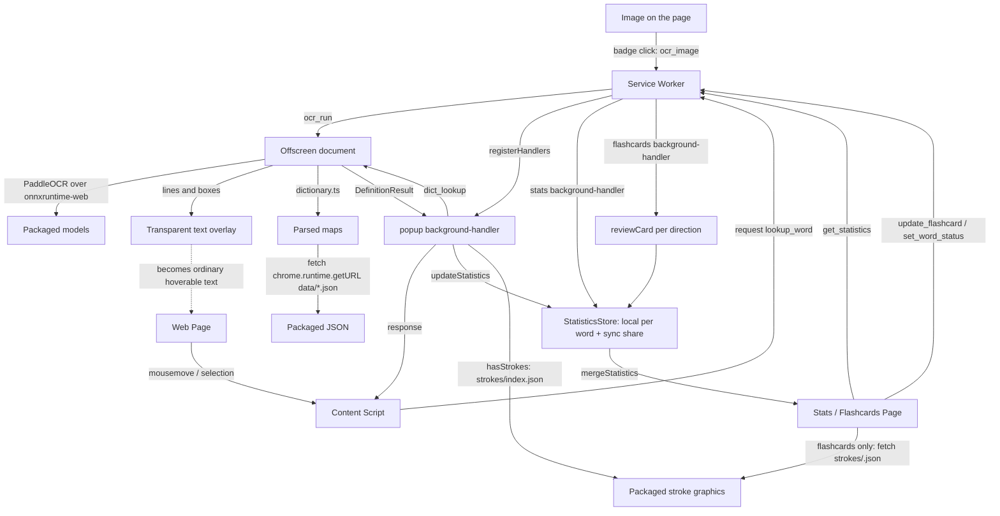

# Architecture Overview

Each file in this directory covers one area and says why it works the way it
does, which is what a change is most likely to break. Read only the files for
the area you are changing.

| Working on | Read |
| --- | --- |
| Hover popup, Shift/Escape, Study/Known | [content-script.md](content-script.md) |
| Unknown-word marks, coverage chip | [page-coverage.md](page-coverage.md) |
| A message type or handler | [background.md](background.md), [data-flow.md](data-flow.md) |
| Lookup, segmentation, enrichment | [dictionary.md](dictionary.md) |
| Image or video OCR | [ocr.md](ocr.md), [ocr-model.md](ocr-model.md) |
| Stats list, insights, backup, export | [stats.md](stats.md) |
| Card directions, sessions, grading | [flashcards.md](flashcards.md) |
| A new setting | [settings.md](settings.md) |
| Anything written to `chrome.storage` | [storage.md](storage.md) |
| A permission or the manifest | [permissions.md](permissions.md) |
| A dependency | [dependencies.md](dependencies.md) |
| Dictionary source data | [dictionary-sources.md](dictionary-sources.md) |
| Finding where a function lives | [key-classes.md](key-classes.md) |
| Where a file belongs in the tree | [structure.md](structure.md) |

## Architecture Flow

