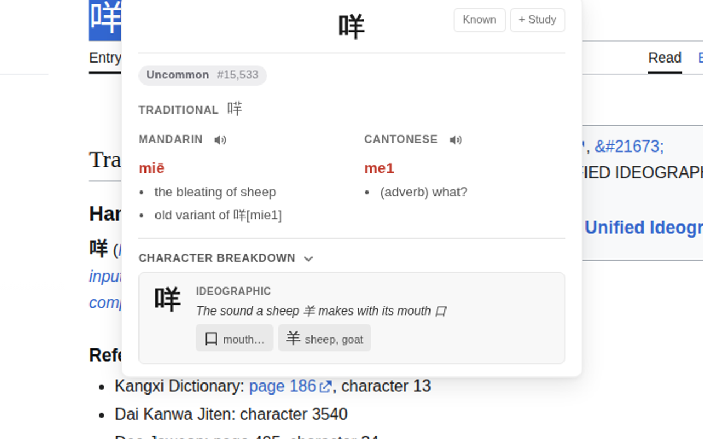
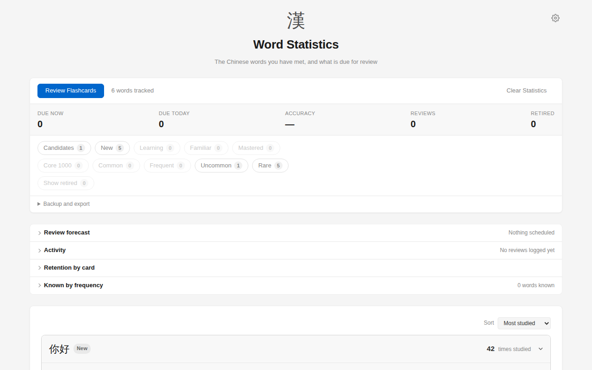
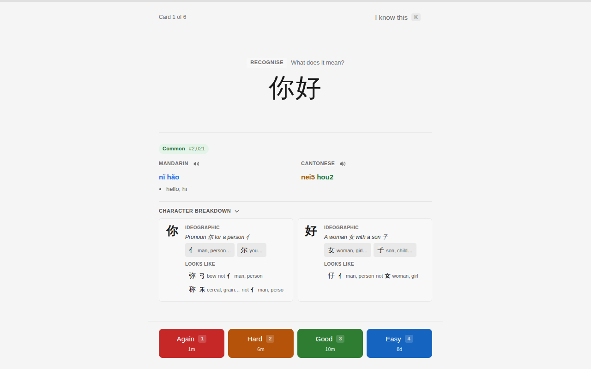
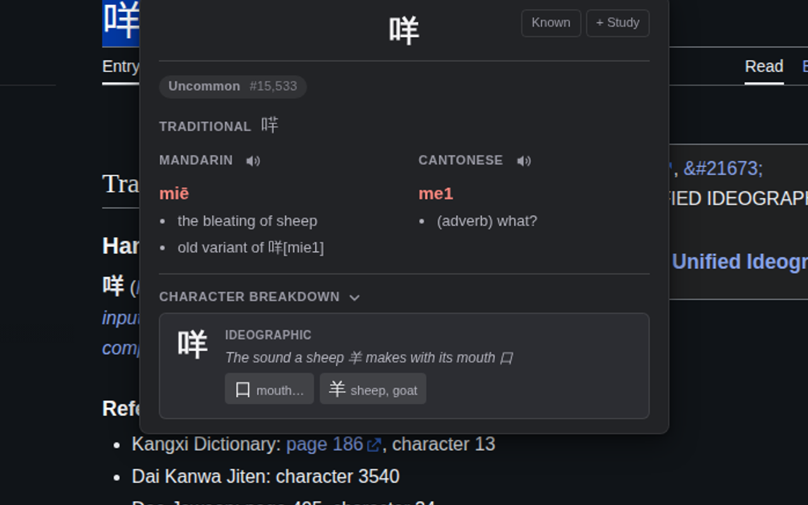

# Canto Toolbox

Read Chinese on the web without leaving the page. Hover any word for Mandarin and Cantonese definitions, then review what you looked up with spaced repetition — so reading doubles as study.

> **Note**: This project is an experiment in using [Claude Code](https://docs.anthropic.com/en/docs/claude-code) as an AI-assisted development environment.

## Features

- **Hover to look up**: rest the cursor on any Chinese text; hold Shift to skip the pause
- **Mandarin and Cantonese side by side**: tone-coloured readings, audio, definitions and word frequency
- **Break words down**: click a character or component to open its own entry
- **Spot unknown words**: optionally underline what you haven't learned, with a page score like "82% known"
- **Review what you read**: words you keep meeting become flashcards, with the sentences you met them in
- **Read images and video**: turn the Chinese in a picture or paused frame into hoverable text
- **Offline and private**: no accounts or API calls; progress syncs across Chrome and exports to Anki or Pleco

## Screenshots

<table>
  <tr>
    <td width="50%"><br><em>Hover popup</em></td>
    <td width="50%"><br><em>Word statistics</em></td>
  </tr>
  <tr>
    <td width="50%"><br><em>Flashcard review</em></td>
    <td width="50%"><br><em>Dark mode</em></td>
  </tr>
</table>

## Installation

Install from the [Chrome Web Store](https://chromewebstore.google.com/detail/canto-toolbox/dcbnbinfginkcchbgnbfcdjflimlgkjd).

To install a specific release instead, download its zip from [Releases](https://github.com/VWongDev/canto-toolbox/releases), unzip it, then load the `dist/` folder with **Load unpacked** at `chrome://extensions/` (with **Developer mode** on).

## Usage

1. **Read**: hover a word, or drag-select a phrase. For images and paused video, click the badge in the corner.
2. **Track**: press **+ Study** to add a word to your deck, or **Known** to skip it. The extension icon opens your word list.
3. **Review**: rate each flashcard Again, Hard, Good or Easy; [FSRS](https://github.com/open-spaced-repetition/ts-fsrs) schedules the next review.
4. **Adjust**: the gear on the word list opens settings for scripts, readings, session size and unknown-word marks.

## Building from Source

### Prerequisites

- **Node.js** >= 22 and **pnpm** >= 8 — or, with [Nix](https://nixos.org/) and [direnv](https://direnv.net/), run `direnv allow` in the repo for the pinned versions
- **Git**, for the dictionary submodules

### Build Steps

```bash
git clone --recurse-submodules https://github.com/VWongDev/canto-toolbox.git
cd canto-toolbox
pnpm install
pnpm build
```

If you cloned without submodules, run `git submodule update --init --recursive` first.

`pnpm build` processes the dictionaries, downloads the OCR model (network access needed the first time) and writes the unpacked extension (~80 MB) to `dist/`. Load it as in [Installation](#installation). `pnpm clean` removes the build output.

## Data and Licences

| Data | Source | Licence |
|------|--------|---------|
| Mandarin dictionary | [CC-CEDICT](https://www.mdbg.net/chinese/dictionary?page=cc-cedict), via [edvardsr/cc-cedict](https://github.com/edvardsr/cc-cedict) | MIT |
| Cantonese dictionary | [CC-Canto](https://cc-canto.org/), via [amadeusine/cc-canto-data](https://github.com/amadeusine/cc-canto-data) — CC-Canto and CC-CEDICT Cantonese readings are copyright (c) 2015-16 Pleco Software Incorporated | CC BY-SA 3.0 |
| Character etymology | [Make Me a Hanzi](https://github.com/skishore/makemeahanzi) | LGPL-3.0 ([COPYING](https://github.com/skishore/makemeahanzi/blob/master/COPYING)) |
| Stroke order | Make Me a Hanzi `graphics.txt`, derived from the Arphic PL KaitiM GB and UKai fonts; drawn by [hanzi-writer](https://github.com/chanind/hanzi-writer) (MIT) | [Arphic Public License](https://github.com/skishore/makemeahanzi/blob/master/APL/english/ARPHICPL.TXT), packaged at `strokes/ARPHICPL.TXT` |
| Word frequency | SUBTLEX-CH — Cai, Q., & Brysbaert, M. (2010). [*PLoS ONE*, 5(6), e10729](https://doi.org/10.1371/journal.pone.0010729), via [chinese-lexicon](https://github.com/peterolson/chinese-lexicon) | ISC |
| Image text recognition | [PaddleOCR](https://www.paddleocr.ai/) PP-OCRv6 tiny, via [snowfluke/ppu-paddle-ocr-models](https://huggingface.co/snowfluke/ppu-paddle-ocr-models); run by [ppu-paddle-ocr](https://github.com/PT-Perkasa-Pilar-Utama/ppu-paddle-ocr) and [onnxruntime-web](https://github.com/microsoft/onnxruntime) (both MIT) | Apache 2.0 |

## Inspiration

The hover detection is inspired by [Zhongwen](https://github.com/cschiller/zhongwen), a Chinese-English popup dictionary extension, extended here to Mandarin and Cantonese.

## License

This project is licensed under the MIT License.

## Contributing

Contributions are welcome — please open an issue or pull request.
